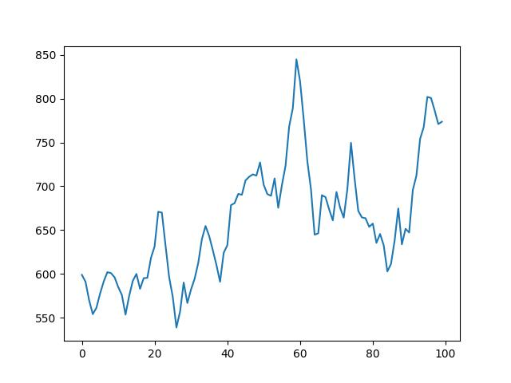
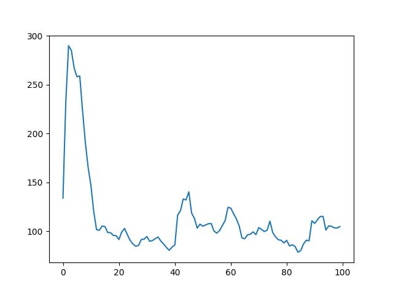

# DDQN Agent for Super Mario Bros

Train a double deep Q neural network (DDQN) agent to play Nintento Super Mario Bros (simulated).

Based on [OpenAI Gym](https://www.gymlibrary.dev/).

## Requirements

- Python==3.9.13 (Python 3.9.x should be fine)

- site-packages

  ~~~shell
  pip install -r requirements.txt
  ~~~

  Pytorch needs manual configuration. See its [website](https://pytorch.org/get-started/locally/)

## Let the agent play!

### Trained agent 

- Trained with 2000 episodes
- 90% chance to follow the trained policy
- 10% chance to act randomly
- need improvement

~~~shell
python play.py
~~~

- [Example video](video/trained.mp4)

https://user-images.githubusercontent.com/100419654/222812866-7629a5ee-033f-4dc2-8ace-b5de884a9154.mp4

### Random agent

- Pick a random action to proceed

~~~shell
python play_untrained.py
~~~

- [Example video](video/untrained.mp4)

https://user-images.githubusercontent.com/100419654/222812980-0f4e194a-9ba1-4a68-a0c3-5d0d78495e4d.mp4

### Comparison and the effect of learning

- The trained agent has learned (to some extent) to jump over the first 3 pipes and the first ditch
- The trained agent moves faster (and gains greater reward from the simulated environment, see [this](https://github.com/Kautenja/gym-super-mario-bros#reward-function))

### Metrics of the trained agent

- Average reward

  

- Average duration of an episode (the shorter duration, the greater moving speed)

  

## Policy network details

### Structure: a mini CNN

1. Input: 4 × 84 × 84 float (transformed rgb representation of the screen: grayscale, resize and stack)
2. (conv2d + relu) * 3
3. flatten
4. (dense + relu) * 2
5. output: x float (x is the dimension of the action-space)

### Algorithm: double deep Q learning

- Values

$$
s = state, ~ s' = next ~ state\\
a = action, ~ a' = next ~ action\\
r = reward\\
\gamma = discount ~ factor\\
input = (s, a)\\
a' = argmax_{a} (Q_{online}(s', a))\\
target = r + \gamma \times Q_{target}(s', a')
$$

- Train the model with *input* and *target*
- Optimizer is Adam optimizer
- Loss function is Huber loss (SmoothL1Loss)
- Sample from a **replay memory** to get **mini-batches**
- Synchronize Q_target with Q_online every C steps (variant of **soft update**?)
- **epsilon-greedy** with a exponentially decaying epsilon (during training)

### Limitations of the agent

- My local machine has a limited GPU memory. As a result, the replay buffer size and the number training episodes are limited.
- May use a **combined** replay memory ([A Deeper Look at Experience Replay](https://arxiv.org/abs/1712.01275))

