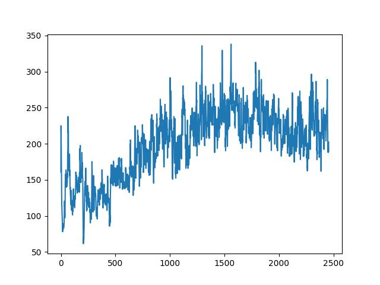
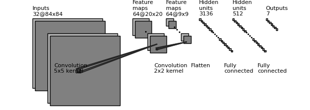

# DDQN Agent for Super Mario Bros

Train a double deep Q neural network (DDQN) agent to play the Nintento Super Mario Bros game.

Based on [OpenAI Gym](https://www.gymlibrary.dev/).

## Requirements

- Python==3.9.13 (Python 3.9.x should be fine)
- gym==0.25.2 (It is not the latest version to keep compatible with gym-super-mario-bros)
- gym-super-mario-bros==7.4.0
- Pytorch needs manual configuration. See its [website](https://pytorch.org/get-started/locally/)

## Let the Agent Play!

### Trained Agent

~~~shell
python play.py
~~~

[Example Video](https://github.com/choutianxius/gym-super-mario-bros/assets/100419654/f5d3b865-3bec-4482-bef7-c20c51bfdff8)

### Random Agent

- Pick a random action to proceed

~~~shell
python play_untrained.py
~~~

[Example Video](https://user-images.githubusercontent.com/100419654/222812980-0f4e194a-9ba1-4a68-a0c3-5d0d78495e4d.mp4)

### Metrics

- Average Reward During Training

  

- Average Loss During Training

  

- Expected Q Value During Training

  

- Average Duration of an Episode During Training

  

- Clear Times in 100 Episodes

  

- Mean Score in 100 Episodes

  

## Training Details

### Policy Network Structure

Following the [2015 DeepMind DQN paper](https://doi.org/10.1038/nature14236)

1. Input: 4 × 84 × 84 float (transformed rgb representation of the screen: grayscale, resize and stack every 4 frames)
2. (conv2d + relu) * 3
3. flatten
4. (dense + relu) * 2
5. output: x float (x is the dimension of the action-space)

### Algorithm: Double Deep Q Learning

Play and Memorize

$$ s = state $$

$$ a_{predict} = action = argmax_{a1}(Q_{online}(s, a1)) $$

$$ a = a_{predict} ~ for ~ 1 - \epsilon ~ probability ~ else ~ a = random ~ action $$

$$ s', r, ... = environment(a) ~ where ~ r = reward $$

$$ save ~ in ~ memory ~ : ~ (s, a, s', r) $$

Learn

$$ Sample ~ from ~ memory ~ : ~ minibatch $$

$$ a' = argmax_{a} (Q_{online}(s', a)) $$

$$ Q_{target} = r + \gamma \times Q_{target}(s', a') $$

$$ Q_{estimate} = Q_{online}(s, a) $$

$$ Perform ~ backpropagation $$

- Play and memorize for every step
- Learn every $C_{1}$ steps
- Synchronize $Q_{target}$ with $Q_{online}$ every $C_{2}$ steps
- **$\epsilon$-greedy** with an exponentially decaying $\epsilon$ (during training)

#### Training Details

- Optimizer is Adam optimizer
- Loss function is Huber loss (`SmoothL1Loss`)
- Learning rate is 0.00025
- $\gamma$ = 0.9
- Length of $memory$ is 100000
- $C_{1}$ = 3
- $C_{2}$ = 10000
- $\epsilon$ exponentially degrades from 1 to 0.02, with degradation factor being 0.99995
- Trained for 50000 episodes
- Trained with 1 Nvidia RTX 4090 graphic card with 24 GB VRAM for about 48 hours
